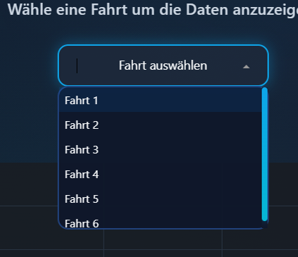
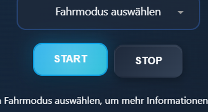
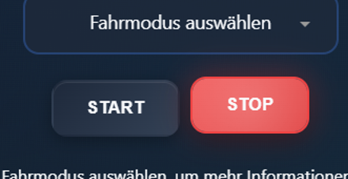
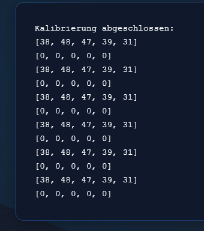
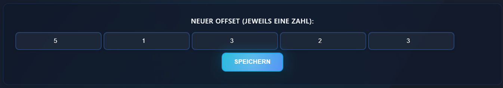

```txt
   ___  _ _____         _____          __           __
  / _ \(_) ___/__ _____/ ___/__  ___  / /________  / /
 / ___/ / /__/ _ `/ __/ /__/ _ \/ _ \/ __/ __/ _ \/ / 
/_/  /_/\___/\_,_/_/  \___/\___/_//_/\__/_/  \___/_/  
```
# What the project does:
It controls a Raspberry Pi 5-powered car using servo motors, infrared and ultrasonic sensors. The collected data is visually displayed in a dashboard made with [Dash](https://dash.plotly.com/).

## Features
- Web interface using Dash
- Logging of vehicle data (JSON)
- Configurable vehicle offsets
- Data visualization
- Multiple driving modes using ultrasonic and infrared sensors

# How to use it:
## PiCarControl Installation Guide
> [!NOTE]
> Requirements you need to run the project smoothly.

- Raspberry Pi / Raspberry Pi OS
- Python 3.7.3
- Git & pip must be installed

### __Clone the project:__
```
git clone git@github.com:myzra/PiCarControl.git  
cd PiCarControl
```
### __Install dependencies:__
__Its recommended to use a virtual enviroment__
```
python3 -m venv venv
source venv/bin/activate
```
__Then install all required packages__
```
pip install -- upgrade pip
pip install -r requirements.txt
```
### __Start the project:__
```
python3 dashboard/app.py
```
### Open in your browser:
`http://0.0.0.0:4200`

## Select and Analyze a Specific Drive
> [!NOTE]
> Drives are stored locally. If you’ve just installed the system, no drives will be available yet.

### Click the "Select Drive" dropdown menu and choose one of the recorded drives. 


## Choose One of the Predefined Driving Modes
### Click the "Select Driving Mode" dropdown menu and choose a mode (1–7).
### Start the drive

### Stop the drive
> [!Warning]
> Currently only works with Driving Mode 1 and 2.



## Calibrate
### Click the "Calibrate" button


> [!NOTE]
> It is normal to wait about 6 seconds before the output appears.



### Fill in the newly shown input fields and click save.


# Logging
soon


