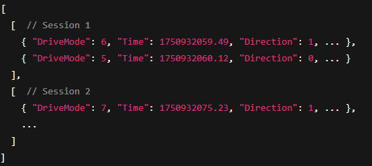

```txt
   ___  _ _____         _____          __           __
  / _ \(_) ___/__ _____/ ___/__  ___  / /________  / /
 / ___/ / /__/ _ `/ __/ /__/ _ \/ _ \/ __/ __/ _ \/ / 
/_/  /_/\___/\_,_/_/  \___/\___/_//_/\__/_/  \___/_/  
```
# What the project does:
It controls a Raspberry Pi 5-powered car using servo motors, infrared and ultrasonic sensors. The collected data is visually displayed in a dashboard made with [Dash](https://dash.plotly.com/).

## Features
- Web interface using Dash
- Logging of vehicle data (JSON)
- Configurable vehicle offsets
- Data visualization
- Multiple driving modes using ultrasonic and infrared sensors

# How to use it:
## PiCarControl Installation Guide
> [!NOTE]
> Requirements you need to run the project smoothly.

- Raspberry Pi / Raspberry Pi OS
- Python 3.7.3
- Git & pip must be installed

### __Clone the project:__
```
git clone git@github.com:myzra/PiCarControl.git  
cd PiCarControl
```
### __Install dependencies:__
__Its recommended to use a virtual enviroment__
```
python3 -m venv venv
source venv/bin/activate
```
__Then install all required packages__
```
pip install -- upgrade pip
pip install -r requirements.txt
```
### __Start the project:__
```
python3 dashboard/app.py
```
### Open in your browser:
`http://0.0.0.0:4200`

## Select and Analyze a Specific Drive
> [!NOTE]
> Drives are stored locally. If you’ve just installed the system, no drives will be available yet.

### Click the "Select Drive" dropdown menu and choose one of the recorded drives. 


## Choose One of the Predefined Driving Modes
### Click the "Select Driving Mode" dropdown menu and choose a mode (1–7).
### Start the drive

### Stop the drive
> [!Warning]
> Currently only works with Driving Mode 1 and 2.


## Calibrate
### Click the "Calibrate" button


> [!NOTE]
> It is normal to wait about 6 seconds before the output appears.


### Fill in the newly shown input fields and click save.


# Logging
## Purpose
The system loggs complete driving sessions to record vehicle behavior, sensor inputs, and control decisions. This data is useful fpr analysis, debugging, and improving driving algorithms.
## Storage Location
All log data is saved to:
`/logs/fahrtenbuch.json`
## Data Structure
The log file is a list of driving sessions, where each session is a list of state entries recorded over time:
 \
Each session starts when the vehicle begins moving and ends when it stops or is reset.

### Entry Format
Each state entry represents a snapshot of the vehicle at a specific time and includes:

| Field       | Description                                                              |
|------------|--------------------------------------------------------------------------|
| `DriveMode`| Current driving mode (e.g., autonomous, line-following)          |
| `Time`     | UNIX timestamp in seconds (float, high precision)                        |
| `Direction`| -1 = reverse, 0 = stop, 1 = forward                                       |
| `Speed`    | Current speed (in cm/s)                                     |
| `Steering` | Steering angle in degrees                                                |
| `Distance` | Distance to obstacle or target    |
| `IR-Sensor`| Array of 4 values (0 = off, 1 = triggered) representing IR sensor states |
### Logging Behavior
- A new session is created for each complete drive
- State snapshots are logged at regular intervals
- The file keeps growing as new sessions are appended
### Use Cases
- Visualizing path and behavior over time
- Evaluating sensor reliability
### Notes
- The format is fully JSON-compliant and easy to parse in Python or other languages

## Project Structure
### 📂 Project Structure

| Path                  | Description                                  |
|-----------------------|----------------------------------------------|
| `/logs/`              | Folder for log files                         |
| `├── fahrtenbuch.json`| JSON file storing all driving sessions       |
| `/software/`          | Source code directory                        |
| `├── basisklassen.py` | Module with base classes for project RPiCar  |
| `├── BaseCar.py`      | Parent class                                 |
| `├── config.json`     | Configuration file to adjust driving offsets |
| `├── save.py`         | Class for saving driving sessions            |
| `├── SensorCar.py`    | Child class                                  |
| `├── SonicCar.py`     | Child class                                  |
| `README.md`           | Project documentation                        |
| `requirements.txt`    | Python dependencies                          |
| `.gitignore`          | Git ignore file                              |
| `/dashboard/`         | Folder for dashboard files                   |
| `├── /assets/`        | Folder for dashboard assets                  |
| `│   └── styles.css`  | CSS file for styling dashboard components    |
| `├── app.py`          | Python Dash application file                 |
| `/doc/`               | Folder for documentation files               |
| `├── ... .png`        | PNG files used in the README.md              |


> [!NOTE]
> _basisklassen.py Author: Robert Heise, Tobias Venn, Florian Edenhofner (FIDA)_

## Key Classes and Modules
### BaseCar (from `BaseCar.py`)
Inherited by: SonicCar, SensorCar \
__Purpose__: Basic functions for a vehicle: drive, direction, steering_angle, motor, steering \
__Attributes__: `speed`, `direction`, `steering_angle`, `motor`, `steering` \
__Methods__: `drive()`, `stop()`, ... 

### SonicCar (from `SonicCar.py`)
Inherits from: BaseCar \
Uses classes from: basisklassen (e.g. `Ultrasonic`, `FrontWheels`) \
__Purpose__: Autonomous driving using an ultrasonic sensor\
__Attributes__:
- `USo`: instance of `Ultrasonic`
- `distance`: last measured distance
- `frontwheels`: instance of `FrontWheels`
- `fahrdaten` (drive data): list to record measurements
__Driving modes__:
- `fahrmodus3()`: Simple obstacle detection system, drives until an object is detected
- `fahrmodus4()`: Dynamic speed adjustment + reverese maneuver on obstacle
__Storage interface__: Uses ``save_fahrdaten` to save log data

### SensorCar (from `SensorCar.py`)
Inherits from: BaseCar \
Uses classes from: basisklassen (e.g. `Ultrasonic`, `Infrared`, `FrontWheels`) \
__Purpose__: Autonomous line-following using infrared sensors with optional ultrasonic obstacle detection \
__Attributes__:
- `USo`: instance of `Ultrasonic` for distance measurement
- `distance`: last measured distance
- `INf`: instance of `Infrared` with configurable offset values
- `fahrdaten`: list to record measurements and sensor data
- `debug`: list for debugging information during driving
- `runde`: lap/round counter
- `timeout`: timeout flag for error handling
- `merker`: flag to track lap completion

__Driving modes__:
- `fahrmodus5()`: Basic line-following using 5 infrared sensors
- `fahrmodus6()`: Enhanced line-following with sharp curve handling and reverse correction
- `fahrmodus7()`: Full autonomous mode with line-following, curve correction, and ultrasonic obstacle detection (stops when object < 5cm)


